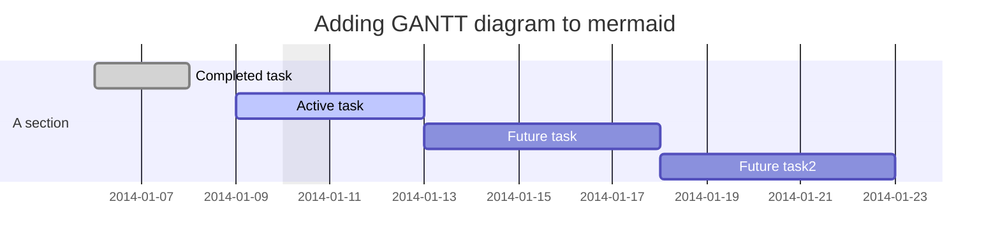
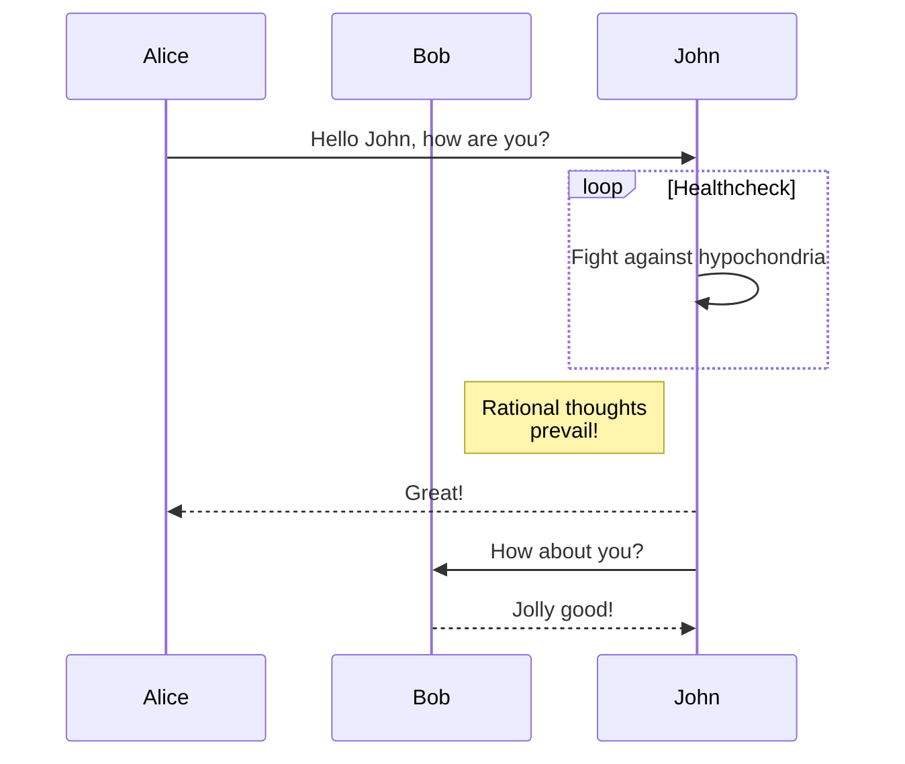
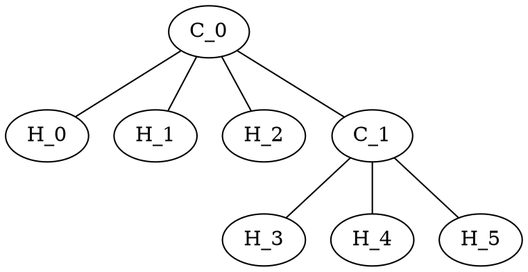
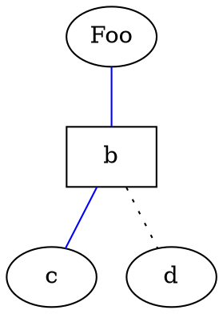
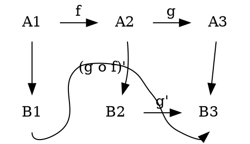
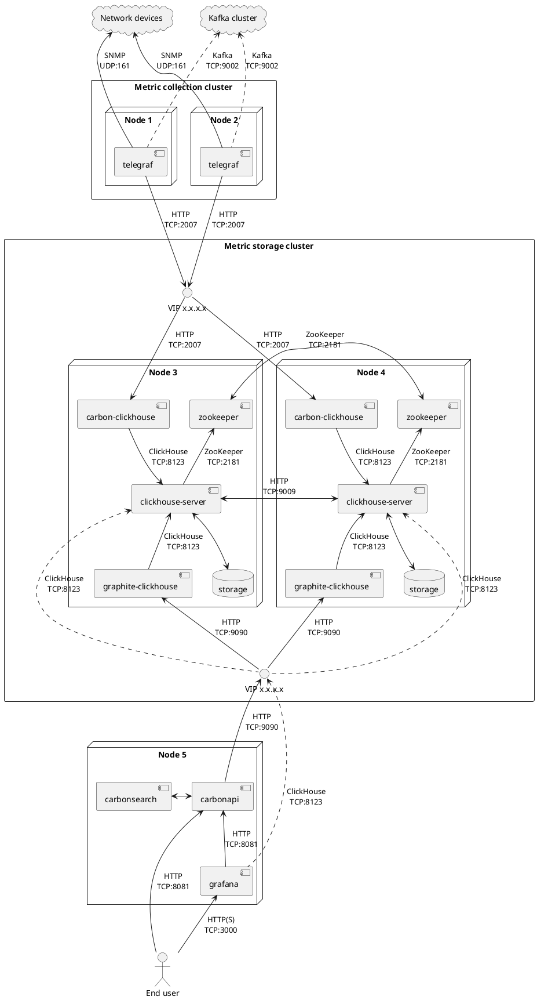

# Extended Markdown Diagram Examples

## Flowcharts

```flow
st=>start: Start:>http://www.google.com[blank]
e=>end:>http://www.google.com
op1=>operation: My Operation
sub1=>subroutine: My Subroutine
cond=>condition: Yes
or No?:>http://www.google.com
io=>inputoutput: catch something...
para=>parallel: parallel tasks

st->op1->cond
cond(yes)->io->e
cond(no)->para
para(path1, bottom)->sub1(right)->op1
para(path2, top)->op1
```

```flow
st=>start: Start|past:>http://www.google.com[blank]
e=>end: End|future:>http://www.google.com
op1=>operation: My Operation|past
op2=>operation: Stuff|current
sub1=>subroutine: My Subroutine|invalid
cond=>condition: Yes
or No?|approved:>http://www.google.com
c2=>condition: Good idea|rejected
io=>inputoutput: catch something...|future

st->op1(right)->cond
cond(yes, right)->c2
cond(no)->sub1(left)->op1
c2(yes)->io->e
c2(no)->op2->e
```

```flow
st=>start: Improve your
l10n process!
e=>end: Continue to have fun!:>https://youtu.be/YQryHo1iHb8[blank]
op1=>operation: Go to locize.com:>https://locize.com[blank]
sub1=>subroutine: Read the awesomeness
cond(align-next=no)=>condition: Interested to
getting started?
io=>inputoutput: Register:>https://www.locize.io/register[blank]
sub2=>subroutine: Read about improving
your localization workflow
or another source:>https://medium.com/@adrai/8-signs-you-should-improve-your-localization-process-3dc075d53998[blank]
op2=>operation: Login:>https://www.locize.io/login[blank]
cond2=>condition: valid password?
cond3=>condition: reset password?
op3=>operation: send email
sub3=>subroutine: Create a demo project
sub4=>subroutine: Start your real project
io2=>inputoutput: Subscribe

st->op1->sub1->cond
cond(yes)->io->op2->cond2
cond2(no)->cond3
cond3(no,bottom)->op2
cond3(yes)->op3
op3(right)->op2
cond2(yes)->sub3
sub3->sub4->io2->e
cond(no)->sub2(right)->op1

st@>op1({"stroke":"Red"})@>sub1({"stroke":"Red"})@>cond({"stroke":"Red"})@>io({"stroke":"Red"})@>op2({"stroke":"Red"})@>cond2({"stroke":"Red"})@>sub3({"stroke":"Red"})@>sub4({"stroke":"Red"})@>io2({"stroke":"Red"})@>e({"stroke":"Red","stroke-width":6,"arrow-end":"classic-wide-long"})
```

## Mermaid






## Ditaa

```ditaa {cmd=true args=["-E"]}
  +--------+   +-------+    +-------+
  |        | --+ ditaa +--> |       |
  |  Text  |   +-------+    |diagram|
  |Document|   |!magic!|    |       |
  |     {d}|   |       |    |       |
  +---+----+   +-------+    +-------+
      :                         ^
      |       Lots of work      |
      +-------------------------+

Color codes
/-------------+-------------\
|cRED RED     |cBLU BLU     |
+-------------+-------------+
|cGRE GRE     |cPNK PNK     |
+-------------+-------------+
|cBLK BLK     |cYEL YEL     |
\-------------+-------------/

/-----------------\
| Things to do    |
| cGRE            |
| o Cut the grass |
| o Buy jam       |
| o Fix car       |
| o Make website  |
\-----------------/

/----\ /----\
|c33F| |cC02|
|    | |    |
\----/ \----/

/----\ /----\
|c1FF| |c1AB|
|    | |    |
\----/ \----/

*----*
|    |      /--*
*    *      |
|    |  -*--+
*----*
----+  /----\  +----+
    :  |    |  :    |
    |  |    |  |{s} |
    v  \-=--+  +----+
```

## GraphViz







## Sequence diagrams

``` sequence  {theme="hand"}
Title: Here is a title
A->B: Normal line
B-->C: Dashed line
C->>D: Open arrow
D-->>A: Dashed open arrow
```

``` sequence  {theme="hand"}
Andrew->China: Says Hello
Note right of China: China thinks\nabout it
China-->Andrew: How are you?
Andrew->>China: I am good thanks!
```

``` sequence  {theme="hand"}
# Example of a comment.
Note left of A: Note to the\n left of A
Note right of A: Note to the\n right of A
Note over A: Note over A
Note over A,B: Note over both A and B
```

``` sequence  {theme="hand"}
participant C
participant B
participant A
Note right of A: By listing the participants\n you can change their order
```

## Waveforms

``` wavedrom
{ signal: [
  { name: "pclk", wave: 'p.......' },
  { name: "Pclk", wave: 'P.......' },
  { name: "nclk", wave: 'n.......' },
  { name: "Nclk", wave: 'N.......' },
  {},
  { name: 'clk0', wave: 'phnlPHNL' },
  { name: 'clk1', wave: 'xhlhLHl.' },
  { name: 'clk2', wave: 'hpHplnLn' },
  { name: 'clk3', wave: 'nhNhplPl' },
  { name: 'clk4', wave: 'xlh.L.Hx' },
]}
```

``` wavedrom
{ signal: [
  { name: 'A', wave: '01........0....',  node: '.a........j' },
  { name: 'B', wave: '0.1.......0.1..',  node: '..b.......i' },
  { name: 'C', wave: '0..1....0...1..',  node: '...c....h..' },
  { name: 'D', wave: '0...1..0.....1.',  node: '....d..g...' },
  { name: 'E', wave: '0....10.......1',  node: '.....ef....' }
  ],
  edge: [
    'a~b t1', 'c-~a t2', 'c-~>d time 3', 'd~-e',
    'e~>f', 'f->g', 'g-~>h', 'h~>i some text', 'h~->j'
  ]
}
```

``` wavedrom
{ signal: [
  { name: "clk",  wave: "P......" },
  { name: "bus",  wave: "x.==.=x", data: ["head", "body", "tail", "data"] },
  { name: "wire", wave: "0.1..0." }
]}
```

``` wavedrom
{ signal: [
  { name: "clk",         wave: "p.....|..." },
  { name: "Data",        wave: "x.345x|=.x", data: ["head", "body", "tail", "data"] },
  { name: "Request",     wave: "0.1..0|1.0" },
  {},
  { name: "Acknowledge", wave: "1.....|01." }
]}
```

``` wavedrom
{ signal: [
  {    name: 'clk',   wave: 'p..Pp..P'},
  ['Master',
    ['ctrl',
      {name: 'write', wave: '01.0....'},
      {name: 'read',  wave: '0...1..0'}
    ],
    {  name: 'addr',  wave: 'x3.x4..x', data: 'A1 A2'},
    {  name: 'wdata', wave: 'x3.x....', data: 'D1'   },
  ],
  {},
  ['Slave',
    ['ctrl',
      {name: 'ack',   wave: 'x01x0.1x'},
    ],
    {  name: 'rdata', wave: 'x.....4x', data: 'Q2'},
  ]
]}
```

``` wavedrom
{ signal: [
  { name: "CK",   wave: "P.......",                                              period: 2  },
  { name: "CMD",  wave: "x.3x=x4x=x=x=x=x", data: "RAS NOP CAS NOP NOP NOP NOP", phase: 0.5 },
  { name: "ADDR", wave: "x.=x..=x........", data: "ROW COL",                     phase: 0.5 },
  { name: "DQS",  wave: "z.......0.1010z." },
  { name: "DQ",   wave: "z.........5555z.", data: "D0 D1 D2 D3" }
]}
```

``` wavedrom
{ signal: [
  { name: 'A', wave: '01..0..',  node: '.a..e..' },
  { name: 'B', wave: '0.1..0.',  node: '..b..d.', phase:0.5 },
  { name: 'C', wave: '0..1..0',  node: '...c..f' },
  {                              node: '...g..h' }
  ],
  edge: [
    'b-|a t1', 'a-|c t2', 'b-|-c t3', 'c-|->e t4', 'e-|>f more text',
    'e|->d t6', 'c-g', 'f-h', 'g<->h 3 ms'
  ],
  config: { hscale: 2 }
}
```

``` wavedrom
(function (bits, ticks) {
  var i, t, gray, state, data = [], arr = [];
  for (i = 0; i < bits; i++) {
    arr.push({name: i + '', wave: ''});
    state = 1;
    for (t = 0; t < ticks; t++) {
      data.push(t + '');
      gray = (((t >> 1) ^ t) >> i) & 1;
      arr[i].wave += (gray === state) ? '.' : gray + '';
      state = gray;
    }
  }
  arr.unshift('gray');
  return {signal: [
    {name: 'bin', wave: '='.repeat(ticks), data: data}, arr
  ]};
})(5, 16)
```


## PlantUML



